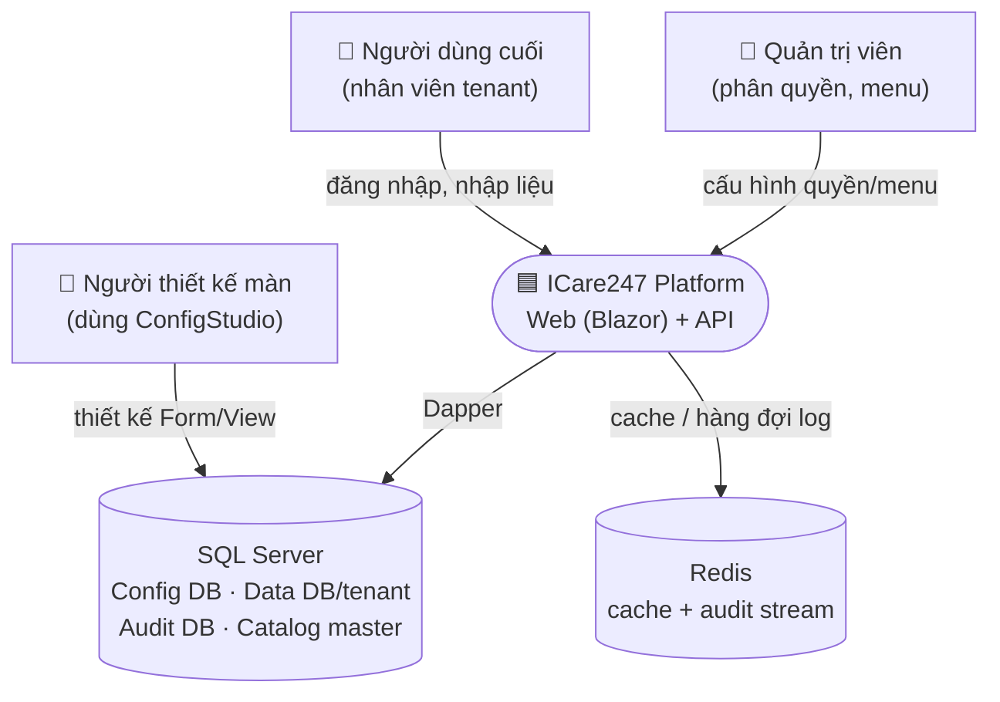
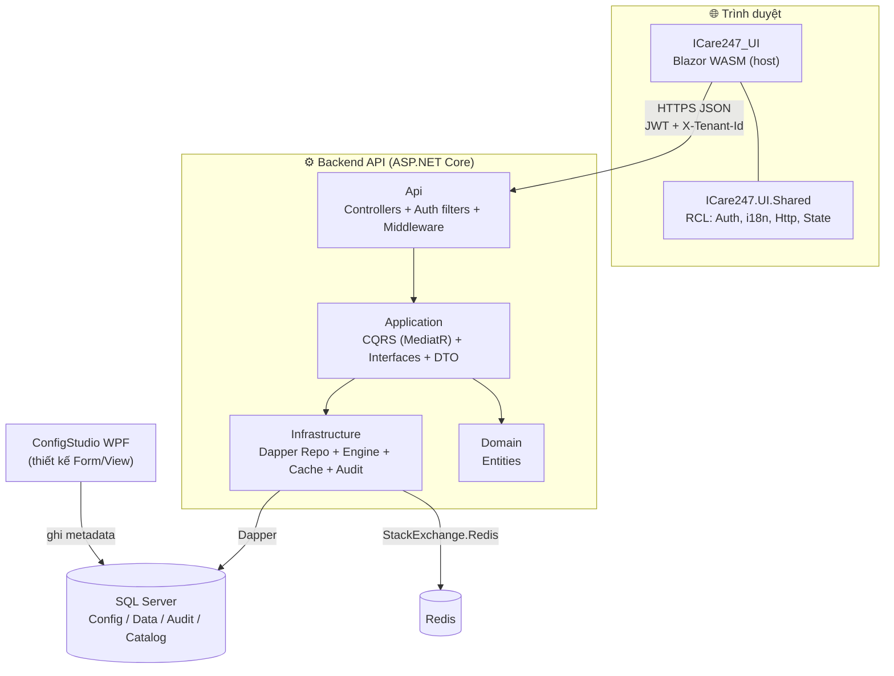
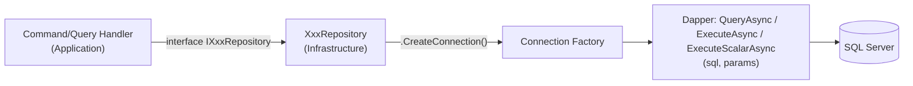
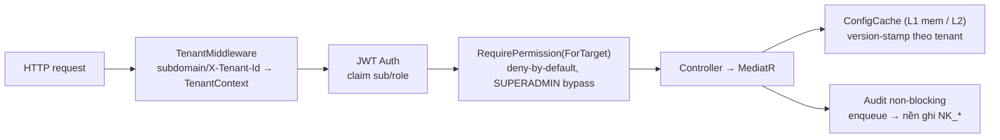

# 00 · Kiến trúc tổng quan (C4 L1 + L2)

> Bức tranh lớn trước khi đi vào từng màn. Đọc cùng [`../spec/01_ARCHITECTURE.md`](../spec/01_ARCHITECTURE.md).

## Tóm tắt 30 giây

ICare247 là **SaaS quản lý đa ngành (no-code)**. Phần lớn màn nghiệp vụ **không code riêng** — chúng được
**cấu hình** (ConfigStudio WPF ghi vào *Config DB*) rồi **engine** dựng UI lúc chạy từ metadata. Mỗi khách hàng
(tenant) có **DB riêng**. Frontend là **Blazor WebAssembly**; backend **ASP.NET Core Clean Architecture + CQRS (MediatR) + Dapper**.

## C4 — Mức 1: Bối cảnh hệ thống (System Context)

- **Người dùng cuối** dùng web nghiệp vụ.
- **Quản trị viên** cấu hình menu/quyền *trong web* (Data DB tenant).
- **Người thiết kế** dùng **ConfigStudio WPF** ghi định nghĩa Form/View *vào Config DB* (không qua API web).

## C4 — Mức 2: Các khối triển khai (Container)

### Quy tắc phụ thuộc (BẮT BUỘC)
`Api → Application → Infrastructure`, và `Application → Domain`. **Domain không phụ thuộc ai.**
Controller **không** gọi thẳng Repository — luôn qua **MediatR** (Command/Query). Chi tiết:
[`../../.claude-rules/architecture.md`](../../.claude-rules/architecture.md).

### Dapper chạm DB ở ĐÂU? (tầng Infrastructure/Repositories)

Đây là điểm hay bị lạc khi đọc dọc: **không tầng nào khác được phép chạm DB**. Toàn bộ SQL nằm trong các
**Repository** ở `Infrastructure/Repositories/*.cs`. Controller/Handler chỉ gọi *interface* (`IXxxRepository`);
Repository mở connection qua **connection factory** rồi chạy Dapper.

| Connection factory | Trỏ tới DB | Dùng cho |
|---|---|---|
| `IDbConnectionFactory` | **Config DB** (`ICare247_Config`) | metadata: `Ui_View`, `Ui_Form`, `Sys_Table`, `Sys_Resource`, … |
| `IDataDbConnectionFactory` | **Data DB của tenant** | nghiệp vụ: `HT_NguoiDung`, danh mục, dữ liệu lưới, … |

Quy ước SQL (xem [`../../.claude-rules/dapper-patterns.md`](../../.claude-rules/dapper-patterns.md)):
- **Luôn tham số hóa** (`@param`) — không nối chuỗi giá trị.
- **Không `SELECT *`** — liệt kê cột tường minh.
- **Identifier động** (tên bảng/cột do cấu hình) phải **whitelist** (regex) rồi bọc `[]` trước khi ghép.
- Mỗi câu SQL THẬT được trỏ trong mục **3c** của từng tài liệu màn.

## Các mối quan tâm xuyên suốt (cross-cutting) — gặp ở MỌI màn

| Mối quan tâm | Ở đâu | Ghi chú |
|---|---|---|
| **Đa tenant** | `TenantMiddleware` → `ITenantContext` | DB-per-tenant; KHÔNG đọc header trực tiếp trong controller (ADR-018) |
| **Xác thực** | JWT (claim `sub`/role) | `TokenStore` (localStorage) ở client |
| **Phân quyền** | `[RequirePermission]` / `[RequirePermissionForTarget]` | deny-by-default; `SUPERADMIN` bypass |
| **Cache cấu hình** | `IConfigCache` | version-stamp theo tenant (CC-4a); bump = vô hiệu toàn bộ |
| **i18n** | `Sys_Resource` (động) + JSON shell (`Loc.L`) | nhãn theo `lang` |
| **Audit** | `IAuditQueue` → `AuditBackgroundService` | non-blocking, DB nhật ký riêng/tenant |

## Bản đồ thư mục code

| Tầng | Đường dẫn |
|---|---|
| Web host | `src/frontend/ICare247_UI/` (Pages, Components, Layout, Services) |
| RCL dùng chung | `src/frontend/ICare247.UI.Shared/` (Auth, I18n, Http, State, Components/Icon) |
| API | `src/backend/src/ICare247.Api/` (Controllers, Authorization, Middleware) |
| Use-case | `src/backend/src/ICare247.Application/Features/**` (CQRS) |
| Hạ tầng | `src/backend/src/ICare247.Infrastructure/` (Repositories, Engine, Cache, Audit) |
| Domain | `src/backend/src/ICare247.Domain/` |
| Thiết kế màn | `src/frontend/ConfigStudio.WPF.UI/` |
| Migration DB | `db/*.sql` |

---
*Cập nhật: 2026-06-20 — bản khung đầu tiên.*
