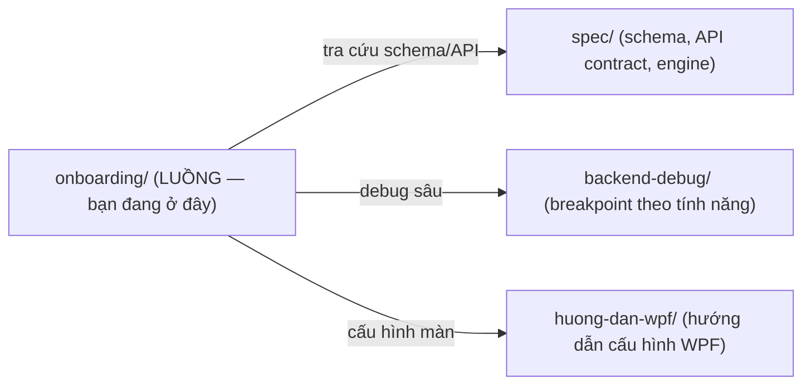

# Tài liệu Onboarding cho Lập trình viên — ICare247 Core

> **Loại tài liệu:** *Developer Onboarding Guide* dựng trên nền *Software Architecture Document (C4)* +
> *Sequence Diagram* + *Data Flow Diagram (DFD)*. Mục tiêu: dev mới đọc hiểu **luồng dữ liệu** và
> **logic hệ thống** của từng màn / từng tính năng mà không cần ai kèm.

## Đọc theo thứ tự nào?

| # | File | Trả lời câu hỏi |
|---|---|---|
| 1 | [`00_kien-truc-tong-quan.md`](00_kien-truc-tong-quan.md) | Hệ thống gồm gì? Lớp nào nói chuyện với lớp nào? (C4 L1/L2) |
| 2 | [`01_muc-luc-man-hinh.md`](01_muc-luc-man-hinh.md) | Web có những màn nào? Mỗi màn thuộc loại gì, tài liệu hóa tới đâu? |
| 3 | [`man-hinh/`](man-hinh/) | Chi tiết từng màn: Sequence + DFD + con trỏ tới code |
| — | [`templates/_TEMPLATE-man-hinh.md`](templates/_TEMPLATE-man-hinh.md) | Khuôn để tài liệu hóa một màn mới |

**Màn mẫu chuẩn** (đọc để nắm cách viết các màn còn lại):
[`man-hinh/view-grid-engine.md`](man-hinh/view-grid-engine.md) — màn lưới engine `/view/{ViewCode}`.

## Quy ước

- **Sơ đồ = Mermaid nhúng trong Markdown.** Render thẳng trên GitHub / VS Code (ext *Markdown Preview Mermaid*) /
  JetBrains. Sửa kèm code, diff theo Git.
- **Con trỏ code** ghi dạng `đường/dẫn/File.cs:dòng` để Ctrl-Click mở thẳng.
- Tài liệu này **mô tả luồng**, KHÔNG chép lại code. Chi tiết schema/API tra ở [`../spec/`](../spec/);
  cách đặt breakpoint debug từng tính năng ở [`../backend-debug/`](../backend-debug/).
- Mỗi khi sửa một luồng → cập nhật đúng file màn tương ứng (xem mục "Lịch sử" cuối mỗi file).

## Liên hệ tài liệu khác

