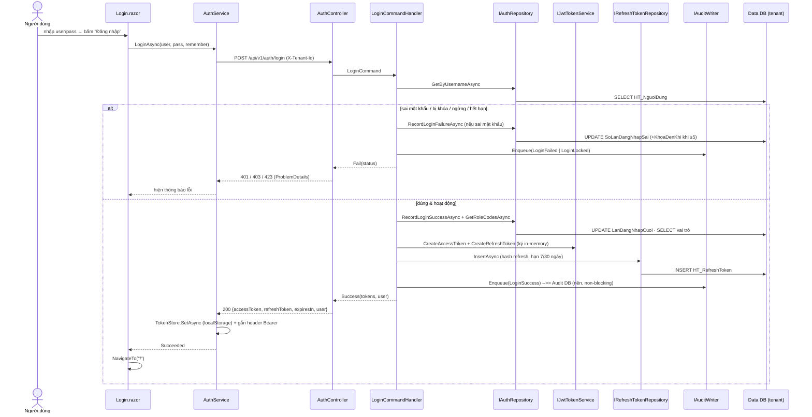
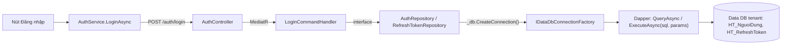
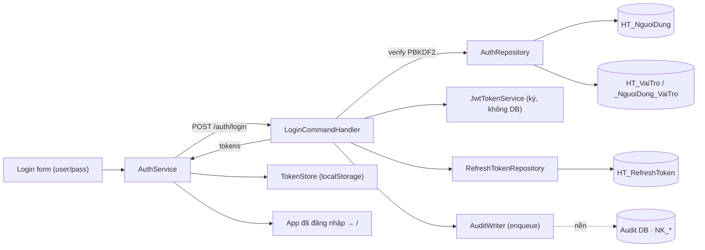

# Màn: Đăng nhập (`/login`)

> Xác thực người dùng bằng tên đăng nhập + mật khẩu → cấp **JWT access token** + **refresh token**.
> Full-stack thật (PBKDF2, lockout, audit). Cổng vào toàn hệ thống.

## 1. Tóm tắt
- **Route:** `/login` (layout `AuthLayout`) · **Component:** [`Pages/Auth/Login.razor`](../../../src/frontend/ICare247_UI/Pages/Auth/Login.razor) · **Loại:** bespoke
- **Quyền:** `[AllowAnonymous]` (chưa đăng nhập) · **Tenant:** TenantMiddleware (subdomain / `X-Tenant-Id`)
- **Nguồn dữ liệu:** `HT_NguoiDung` (Data DB tenant) + `HT_RefreshToken`; nhật ký → Audit DB riêng
- **Bảo mật:** PBKDF2 verify · khóa tạm **5 lần sai / 15 phút** · chống-dò-tài-khoản (mọi lỗi → "sai thông tin")

## 2. Các nhân vật (lớp tham gia)
| Lớp | Vai trò | File |
|---|---|---|
| `Login.razor` | Form đăng nhập, hiện lỗi, redirect khi đã đăng nhập | [Login.razor](../../../src/frontend/ICare247_UI/Pages/Auth/Login.razor) |
| `IAuthService` / `AuthService` | Gọi `/auth/login`, lưu token, gắn header Bearer | [Shared/Services/Auth/AuthService.cs](../../../src/frontend/ICare247.UI.Shared/Services/Auth/AuthService.cs) |
| `TokenStore` | Lưu access/refresh token vào localStorage | [Shared/Services/Auth/TokenStore.cs](../../../src/frontend/ICare247.UI.Shared/Services/Auth/TokenStore.cs) |
| `JwtAuthenticationStateProvider` | Báo Blazor trạng thái đăng nhập đổi | [Shared/Services/Auth/JwtAuthenticationStateProvider.cs](../../../src/frontend/ICare247.UI.Shared/Services/Auth/JwtAuthenticationStateProvider.cs) |
| `AuthController` | REST `/api/v1/auth/*`, map lỗi → HTTP | [Api/Controllers/AuthController.cs](../../../src/backend/src/ICare247.Api/Controllers/AuthController.cs) |
| `LoginCommandHandler` | Verify mật khẩu, lockout, cấp token, audit | [Features/Auth/Login/LoginCommandHandler.cs](../../../src/backend/src/ICare247.Application/Features/Auth/Login/LoginCommandHandler.cs) |
| `IAuthRepository` | Đọc user, ghi nhận sai/thành công, lấy vai trò | `Infrastructure/Repositories/AuthRepository.cs` |
| `IJwtTokenService` | Ký access token (JWT) + sinh refresh token | `Infrastructure/Auth/JwtTokenService.cs` |
| `IRefreshTokenRepository` | Lưu hash refresh token | `Infrastructure/Repositories/RefreshTokenRepository.cs` |
| `IAuditWriter` | Enqueue nhật ký (non-blocking) | `Application/Interfaces/IAuditWriter.cs` |

## 3. Sequence — đăng nhập (thành công vs thất bại)



## 3b. Ma trận: NÚT → API → LỆNH CQRS → DB ⭐

| # | Nút / Thao tác | Handler frontend | API (verb + endpoint) | Lệnh CQRS | Bảng DB | R/W |
|---|---|---|---|---|---|---|
| 1 | **Mở màn** (đã đăng nhập → về `/`) | `OnInitializedAsync` → `Auth.InitializeAsync` | *(không gọi API)* — đọc token localStorage | — | localStorage (`ic247.accessToken`) | — |
| 2 | **Đăng nhập** (submit form) | `HandleLogin` → `Auth.LoginAsync` | `POST /api/v1/auth/login` | `LoginCommand` | Data: `HT_NguoiDung` (SELECT; UPDATE sai/thành công) · `HT_NguoiDung_VaiTro`+`HT_VaiTro` (SELECT vai trò) · `HT_RefreshToken` (**INSERT**) · Audit DB `NK_*` (enqueue) | **R/W** |
| 3 | **Ghi nhớ đăng nhập** (checkbox) | `_remember` → cờ trong body | *(gửi kèm login)* | `LoginCommand.RememberMe` | đổi hạn refresh: 7 → **30 ngày** | — |
| 4 | **Quên mật khẩu?** (link) | `NavigateTo` | — *(sang `/forgot-password`)* | — | — | — |

**Liên quan (kích hoạt ở màn khác, cùng feature Auth):**
| Thao tác | Nơi gọi | API | CQRS | Bảng DB |
|---|---|---|---|---|
| Đăng xuất | nút ⎋ ở `MainLayout` | `POST /auth/logout` | `LogoutCommand` | `HT_RefreshToken` (thu hồi — UPDATE) |
| Làm mới token | tự động khi access hết hạn | `POST /auth/refresh` | `RefreshTokenCommand` | `HT_RefreshToken` (rotate: thu hồi cũ + INSERT mới) |

## 3c. Tầng Dapper — câu SQL THẬT chạm DB ⭐

> Đây là nơi *thật sự* nói chuyện với SQL Server. Mọi Command/Query ở bảng 3b cuối cùng gọi xuống một
> **Repository (Infrastructure)**; repository mở connection qua `IDataDbConnectionFactory.CreateConnection()`
> (= **Data DB của tenant hiện tại**, resolve từ `TenantContext`) rồi chạy Dapper. **100% tham số hóa, KHÔNG `SELECT *`.**

**Mẫu gọi Dapper (lặp lại ở mọi repo):**
```csharp
using var conn = _db.CreateConnection();                    // IDataDbConnectionFactory → Data DB tenant
return await conn.QueryFirstOrDefaultAsync<NguoiDung>(       // hoặc QueryAsync / ExecuteAsync
    new CommandDefinition(sql, new { Username = username },  // tham số hóa @Username
        cancellationToken: ct));
```

**Các câu SQL của luồng đăng nhập:**

| Lệnh CQRS gọi | Repo.Method (file:dòng) | SQL (rút gọn) | Bảng | Thao tác |
|---|---|---|---|---|
| `LoginCommand` (bước 1) | `AuthRepository.GetByUsernameAsync` [:30](../../../src/backend/src/ICare247.Infrastructure/Repositories/AuthRepository.cs) | `SELECT <cột> FROM dbo.HT_NguoiDung WHERE TenDangNhap=@Username AND IsDeleted=0` | `HT_NguoiDung` | đọc 1 dòng |
| `LoginCommand` (vai trò) | `AuthRepository.GetRoleCodesAsync` [:48](../../../src/backend/src/ICare247.Infrastructure/Repositories/AuthRepository.cs) | `SELECT vt.Ma FROM HT_NguoiDung_VaiTro ndvt JOIN HT_VaiTro vt …` | `HT_NguoiDung_VaiTro` + `HT_VaiTro` | đọc list |
| `LoginCommand` (sai pass) | `AuthRepository.RecordLoginFailureAsync` [:80](../../../src/backend/src/ICare247.Infrastructure/Repositories/AuthRepository.cs) | `UPDATE HT_NguoiDung SET SoLanDangNhapSai=@Count, KhoaDenKhi=@LockUntil, Ver=Ver+1 …` | `HT_NguoiDung` | **ghi** |
| `LoginCommand` (thành công) | `AuthRepository.RecordLoginSuccessAsync` [:63](../../../src/backend/src/ICare247.Infrastructure/Repositories/AuthRepository.cs) | `UPDATE HT_NguoiDung SET SoLanDangNhapSai=0, KhoaDenKhi=NULL, LanDangNhapCuoi=SYSUTCDATETIME() …` | `HT_NguoiDung` | **ghi** |
| `LoginCommand` (cấp phiên) | `RefreshTokenRepository.InsertAsync` [:22](../../../src/backend/src/ICare247.Infrastructure/Repositories/RefreshTokenRepository.cs) | `INSERT INTO HT_RefreshToken (NguoiDung_Id, TokenHash, HetHan, …) VALUES (…)` | `HT_RefreshToken` | **ghi** |
| `LogoutCommand` | `RefreshTokenRepository.RevokeAllForUserAsync` [:75](../../../src/backend/src/ICare247.Infrastructure/Repositories/RefreshTokenRepository.cs) | `UPDATE HT_RefreshToken SET DaThuHoi=1, ThuHoiLuc=SYSUTCDATETIME() WHERE NguoiDung_Id=@UserId` | `HT_RefreshToken` | **ghi** |
| `RefreshTokenCommand` | `RefreshTokenRepository.GetByHashAsync` [:43](../../../src/backend/src/ICare247.Infrastructure/Repositories/RefreshTokenRepository.cs) + `RevokeAsync`+`InsertAsync` | `SELECT … WHERE TokenHash=@TokenHash` → revoke cũ → insert mới | `HT_RefreshToken` | đọc + **ghi** |

> **Lưu ý:** `IJwtTokenService` (ký token) và `IAuditWriter` (enqueue) **KHÔNG** đi qua Dapper — JWT ký in-memory,
> audit ghi ở **DB khác** (Audit DB) bằng `SqlBulkCopy` ở background, không trong transaction đăng nhập.

### Chuỗi đầy đủ: từ nút bấm tới câu SQL


## 4. DFD — dữ liệu đi đâu



## 5. Logic / quy tắc cần biết
- **Chống dò tài khoản:** không tồn tại / không phải `Local` / chưa đặt mật khẩu / sai mật khẩu → đều trả **`InvalidCredentials`** (401, cùng một thông điệp).
- **Lockout:** đủ **5 lần sai liên tiếp** → khóa **15 phút** (`KhoaDenKhi`); trong thời gian khóa trả **423 Locked** kèm số phút còn lại.
- **Kiểm trạng thái** theo thứ tự: khóa tạm → `TrangThai=HoatDong`? → `HetHanTaiKhoan`? → verify mật khẩu → `HinhThuc2FA=None`? (2FA hiện **chưa hỗ trợ** → 401 TwoFactorRequired).
- **Token:** access = JWT (claim `sub`/role/tenant/admin); refresh = chuỗi ngẫu nhiên, **chỉ lưu HASH** ở DB. Hạn refresh **7 ngày** (mặc định) / **30 ngày** (Ghi nhớ).
- **JwtTokenService KHÔNG chạm DB** — ký bằng `Jwt:SecretKey` (HMAC-SHA256).
- **Audit non-blocking:** chỉ `Enqueue` (micro-giây); ghi DB nhật ký **riêng/tenant** ở nền — login không bao giờ khựng vì log.
- **Client:** lưu token vào **localStorage** (`TokenStore`) để sống sót reload; gắn `Authorization: Bearer` cho mọi request sau.
- **Đã đăng nhập mà vào `/login`** → tự về `/` (không bắt đăng nhập lại).

## 6. Trường hợp biên & lỗi thường gặp
| Tình huống | HTTP | Hành vi | Xử ở đâu |
|---|---|---|---|
| Sai user/mật khẩu | 401 | "Tên đăng nhập hoặc mật khẩu không đúng" | `MapFailure` [AuthController.cs:103](../../../src/backend/src/ICare247.Api/Controllers/AuthController.cs) |
| Khóa tạm (≥5 lần sai) | 423 | "Thử lại sau N phút" | `AuthStatus.Locked` |
| Tài khoản ngừng / hết hạn | 403 | thông báo liên hệ admin | `Disabled` / `Expired` |
| Yêu cầu 2FA | 401 | "đang hoàn thiện" | `TwoFactorRequired` |
| Không kết nối được server | — | "Không kết nối được máy chủ: …" | `AuthService.LoginAsync` catch |
| Bỏ trống user/pass | — | chặn ở client, không gọi API | `HandleLogin` [Login.razor:95](../../../src/frontend/ICare247_UI/Pages/Auth/Login.razor) |

## 7. Con trỏ code & liên quan
- **Frontend:** `Pages/Auth/Login.razor`, `Shared/Services/Auth/{AuthService,TokenStore,JwtAuthenticationStateProvider}.cs`, `Components/Auth/*`
- **Backend:** `Api/Controllers/AuthController.cs`, `Application/Features/Auth/Login/*`, `Infrastructure/Repositories/{AuthRepository,RefreshTokenRepository}.cs`, `Infrastructure/Auth/JwtTokenService.cs`
- **Spec/Debug:** [`../../backend-debug/`](../../backend-debug/) (trang *auth-login*) · [`../../spec/11_DATA_DB_SCHEMA.md`](../../spec/11_DATA_DB_SCHEMA.md) (HT_NguoiDung, HT_RefreshToken)
- **Design màn:** auto-memory `design-login-hitech` (split 2 cột, motif riêng)

---
*Cập nhật: 2026-06-21 — màn thứ 2 của bộ onboarding.*
