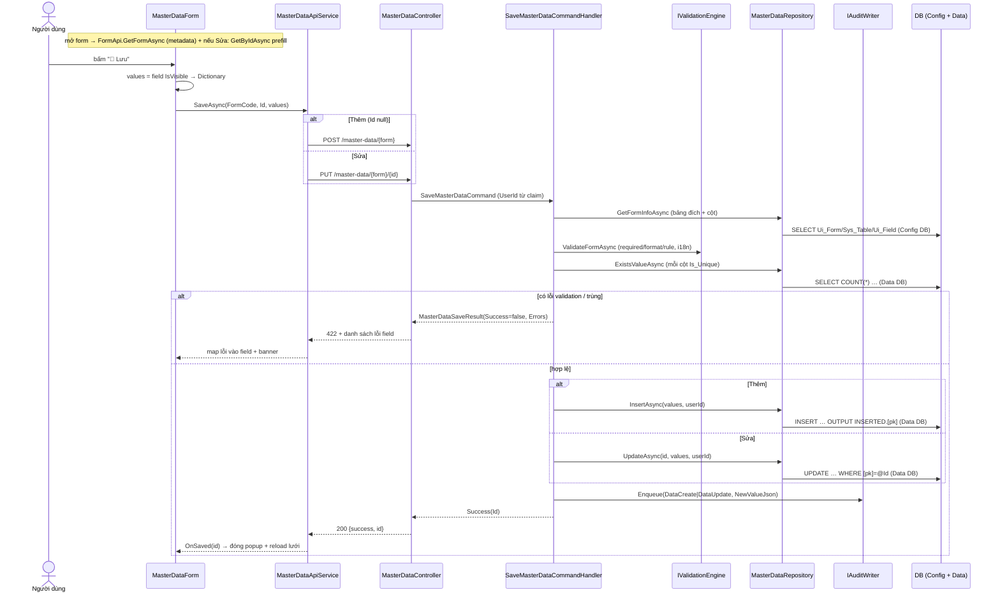
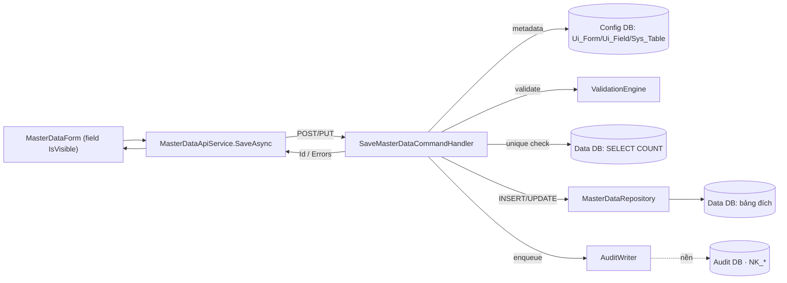

# Form Thêm/Sửa danh mục (MasterDataForm)

> Component popup/trang dùng chung để **ghi 1 bản ghi danh mục** (engine, metadata-driven). Mở từ màn lưới
> (View hoặc MasterDataListPage) qua `Edit_Form_Code`. Đây là **luồng GHI tiêu biểu**: validate server-side →
> INSERT/UPDATE bằng Dapper → audit. (Là con của [view-grid-engine](view-grid-engine.md), không có route riêng.)

## 1. Tóm tắt
- **Component:** [`Components/MasterData/MasterDataForm.razor`](../../../src/frontend/ICare247_UI/Components/MasterData/MasterDataForm.razor) · **Loại:** engine
- **Tham số:** `FormCode` + `Id` (null = Thêm, có = Sửa) · phát `OnSaved(id)` / `OnCancelled`
- **Quyền:** `Form·Thêm` (POST) / `Form·Sửa` (PUT) — `[RequirePermissionForTarget("Form", …)]`
- **Bảng đích:** suy từ `Ui_Form → Sys_Table` (Config DB); CRUD chạy trên **Data DB tenant**
- **Payload Lưu = mọi field `IsVisible`** (field ẩn bị loại; field khóa read-only/LockOnEdit **vẫn gửi**)

## 2. Các nhân vật (lớp tham gia)
| Lớp | Vai trò | File |
|---|---|---|
| `MasterDataForm` | Render field, prefill, dựng payload, gọi Lưu | [MasterDataForm.razor](../../../src/frontend/ICare247_UI/Components/MasterData/MasterDataForm.razor) |
| `FieldRenderer` (+ `FieldRenderers/*`) | Vẽ control theo `FieldType` | [Components/FieldRenderer.razor](../../../src/frontend/ICare247_UI/Components/FieldRenderer.razor) |
| `FormApiService` | Lấy metadata form (cấu trúc field) | `Services/FormApiService.cs` |
| `MasterDataApiService` | `GetByIdAsync` (prefill) + `SaveAsync` (POST/PUT) | [Services/MasterDataApiService.cs](../../../src/frontend/ICare247_UI/Services/MasterDataApiService.cs) |
| `MasterDataController` | REST `/api/v1/master-data`, map 422/409 | [Api/Controllers/MasterDataController.cs](../../../src/backend/src/ICare247.Api/Controllers/MasterDataController.cs) |
| `SaveMasterDataCommandHandler` | Validate + unique-check + Insert/Update + audit | [Features/MasterData/Commands/SaveMasterData/…Handler.cs](../../../src/backend/src/ICare247.Application/Features/MasterData/Commands/SaveMasterData/SaveMasterDataCommandHandler.cs) |
| `IValidationEngine` | Validate toàn form server-side | `Domain/Engine` |
| `IMasterDataRepository` / `MasterDataRepository` | Dapper CRUD generic | [Infrastructure/Repositories/MasterDataRepository.cs](../../../src/backend/src/ICare247.Infrastructure/Repositories/MasterDataRepository.cs) |
| `IAuditWriter` | Enqueue nhật ký ghi (non-blocking) | `Application/Interfaces/IAuditWriter.cs` |

## 3. Sequence — Lưu (Thêm/Sửa)



## 3b. Ma trận: NÚT → API → LỆNH CQRS → DB ⭐

| # | Nút / Thao tác | Handler frontend | API (verb + endpoint) | Quyền | Lệnh CQRS | Bảng DB | R/W |
|---|---|---|---|---|---|---|---|
| 1 | **Mở form** (metadata) | `LoadAsync` → `FormApi.GetFormAsync` | `GET /api/v1/forms/{code}` *(FormController)* | Form·Xem | *(query form)* | Config: `Ui_Form`,`Ui_Field`,`Sys_Column`,`Sys_Resource` | R |
| 2 | **Mở form Sửa** (prefill) | `MasterApi.GetByIdAsync` | `GET /master-data/{form}/{id}` | Form·Xem | `GetMasterDataRecordQuery` | Data: bảng đích (SELECT) | R |
| 3 | **💾 Lưu — Thêm** | `SaveAsync` → `MasterApi.SaveAsync(id=null)` | `POST /master-data/{form}` | Form·Thêm | `SaveMasterDataCommand` | Data: bảng đích **INSERT** (+`CreatedBy/At`) · Audit `NK_*` (enqueue) | W |
| 4 | **💾 Lưu — Sửa** | `SaveAsync` → `MasterApi.SaveAsync(id)` | `PUT /master-data/{form}/{id}` | Form·Sửa | `SaveMasterDataCommand` | Data: bảng đích **UPDATE** (+`UpdatedBy/At`) · Audit `NK_*` | W |
| 5 | **Hủy** | `Cancel` → `OnCancelled` | *(không API)* | — | — | — | — |

> Trước khi ghi (dòng 3/4) handler còn chạy **đọc thêm**: `GetFormInfoAsync` (Config) + `ExistsValueAsync` (Data, mỗi cột `Is_Unique`).

## 3c. Tầng Dapper — câu SQL THẬT chạm DB ⭐

> 2 connection factory: `IDbConnectionFactory` → **Config DB** (metadata), `IDataDbConnectionFactory` → **Data DB** (ghi).
> Bảng đích = `[Schema_Name].[Table_Code]`. **Whitelist** mọi identifier qua regex + chỉ ghi **cột field** (`BuildColumnParams`,
> loại read-only/PK/cột lạ). Cột audit (`CreatedBy/At`,`UpdatedBy/At`) **chỉ bơm nếu bảng đích thật sự có** (dò `INFORMATION_SCHEMA`).

| Lệnh / bước | Repo.Method (file:dòng) | DB | SQL (rút gọn) | Bảng |
|---|---|---|---|---|
| form info | `MasterDataRepository.GetFormInfoAsync` [:38](../../../src/backend/src/ICare247.Infrastructure/Repositories/MasterDataRepository.cs) | Config (+Data cho PK) | `SELECT … FROM Ui_Form JOIN Sys_Table`; `Sys_Column (Is_PK)`; `Ui_Field JOIN Sys_Column LEFT JOIN Sys_Resource` | `Ui_Form`,`Sys_Table`,`Sys_Column`,`Ui_Field`,`Sys_Resource` |
| unique check | `ExistsValueAsync` [:120](../../../src/backend/src/ICare247.Infrastructure/Repositories/MasterDataRepository.cs) | Data | `SELECT COUNT(*) FROM {table} WHERE [col]=@Val [AND [pk]<>@ExcludeId]` | bảng đích |
| prefill (Sửa) | `GetByIdAsync` [:220](../../../src/backend/src/ICare247.Infrastructure/Repositories/MasterDataRepository.cs) | Data | `SELECT * FROM {table} WHERE [pk]=@Id` | bảng đích |
| **INSERT** | `InsertAsync` [:240](../../../src/backend/src/ICare247.Infrastructure/Repositories/MasterDataRepository.cs) | Data | `INSERT INTO {table} ({cột},[CreatedBy],[CreatedAt]) OUTPUT INSERTED.[pk] AS NewId VALUES (@…, @__CreatedBy, SYSUTCDATETIME())` | bảng đích |
| **UPDATE** | `UpdateAsync` [:274](../../../src/backend/src/ICare247.Infrastructure/Repositories/MasterDataRepository.cs) | Data | `UPDATE {table} SET [col]=@col …, [UpdatedBy]=@__UpdatedBy, [UpdatedAt]=SYSUTCDATETIME() WHERE [pk]=@__Id` | bảng đích |

**Mẫu dựng INSERT động an toàn:**
```csharp
var (cols, dp) = BuildColumnParams(info, values, excludeCol: pk);   // chỉ field hợp lệ, không readonly/PK
var insCols = cols.Select(Bracket).ToList();                        // [Col] (đã whitelist regex)
var insVals = cols.Select(c => "@" + c).ToList();                   // @Col (Dapper param)
if (audit.Contains("CreatedBy") && userId is not null) { insCols.Add("[CreatedBy]"); insVals.Add("@__CreatedBy"); }
var sql = $"INSERT INTO {table} ({string.Join(", ", insCols)}) " +
          $"OUTPUT INSERTED.{Bracket(pk)} AS NewId VALUES ({string.Join(", ", insVals)})";
using var data = _dataDb.CreateConnection();
return await data.ExecuteScalarAsync<object>(new CommandDefinition(sql, dp, cancellationToken: ct));
```

## 4. DFD — dữ liệu đi đâu


## 5. Logic / quy tắc cần biết
- **Payload = field `IsVisible`** (memory `feedback-form-save-payload-visible`): field ẩn KHÔNG gửi; field khóa (read-only/LockOnEdit) **vẫn gửi** (để qua validation required, giá trị không đổi nên vô hại). [MasterDataForm.razor:152](../../../src/frontend/ICare247_UI/Components/MasterData/MasterDataForm.razor)
- **Validation 2 lớp:** client (FieldRenderer) + **server bắt buộc** (`ValidationEngine.ValidateFormAsync`) — server là hàng rào thật.
- **Chống cột lạ:** chỉ ghi cột thuộc field form, **không readonly, không PK**, identifier qua regex (`BuildColumnParams`).
- **Audit cột tự bơm:** `CreatedBy/At` (insert) · `UpdatedBy/At` (update) — chỉ khi bảng đích **có** cột đó (dò `INFORMATION_SCHEMA`); KHÔNG dựa DEFAULT của DB (memory `feedback-explicit-audit-columns`).
- **Unique:** mỗi cột `Is_Unique` → `SELECT COUNT(*)` (loại chính bản ghi đang sửa qua `@ExcludeId`); message i18n token `{0}`=giá trị, `{1}`=nhãn.
- **Kết quả:** lỗi → **422** + danh sách `{FieldCode, Message}` (map về field + banner); thành công → **200** + `Id` → `OnSaved` đóng popup + reload lưới.
- **Audit ghi:** `AuditCategory.MasterData`, `NewValueJson` = JSON các giá trị gửi lên (non-blocking → Audit DB riêng).

## 6. Trường hợp biên & lỗi thường gặp
| Tình huống | HTTP | Hành vi | Xử ở đâu |
|---|---|---|---|
| Validation fail / trùng unique | 422 | lỗi gắn vào field + banner "Có N lỗi…" | `SaveAsync` map `result.Errors` |
| Xóa bản ghi đang bị tham chiếu | 409 | (ở dialog xóa) — không thuộc form Lưu | `MasterDataController.Delete` |
| Form không tồn tại | — | banner "Form '…' không tồn tại" | `LoadAsync` |
| Không cột hợp lệ để ghi | 500 | `InvalidOperationException` | `InsertAsync`/`UpdateAsync` |
| Field ẩn nhưng required | — | không gửi → có thể fail validation server | thiết kế ở ConfigStudio |

## 7. Con trỏ code & liên quan
- **Frontend:** `Components/MasterData/MasterDataForm.razor`, `Components/FieldRenderer*.razor`, `Services/{MasterDataApiService,FormApiService}.cs`
- **Backend:** `Api/Controllers/MasterDataController.cs`, `Application/Features/MasterData/Commands/SaveMasterData/*`, `Infrastructure/Repositories/MasterDataRepository.cs`
- **Engine:** `Domain/Engine` (ValidationEngine) · [`../../spec/04_ENGINE_SPEC.md`](../../spec/04_ENGINE_SPEC.md)
- **Liên quan:** mở từ [view-grid-engine](view-grid-engine.md) (§3b dòng Thêm/Sửa)

---
*Cập nhật: 2026-06-21 — màn thứ 4 (luồng GHI dữ liệu).*
