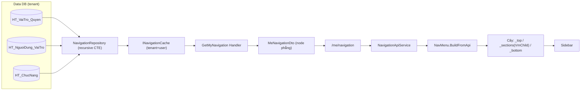

# Sau đăng nhập: Shell + Menu điều hướng (`/`)

> Login thành công → điều hướng `/`. Trang chủ (**Dashboard**) render *bên trong* **MainLayout** (sidebar + topbar);
> **NavMenu** nạp **menu server-driven theo quyền** từ `GET /me/navigation`. Đây là "khung" bao mọi màn nghiệp vụ.

## 1. Tóm tắt
- **Route:** `/` (Dashboard) · **Layout:** [`Layout/MainLayout.razor`](../../../src/frontend/ICare247_UI/Layout/MainLayout.razor) + [`Layout/NavMenu.razor`](../../../src/frontend/ICare247_UI/Layout/NavMenu.razor)
- **Quyền:** chưa đăng nhập → MainLayout tự đẩy về `/login`; menu lọc theo `HT_VaiTro_Quyen.Xem=1`
- **Nguồn dữ liệu:** `HT_ChucNang` (cây chức năng) + `HT_VaiTro_Quyen` + `HT_NguoiDung_VaiTro` (Data DB tenant)
- **Dashboard:** hiện là **placeholder** (KPI tĩnh `—`, KHÔNG gọi API) — sẽ gắn widget thật sau

## 2. Các nhân vật (lớp tham gia)
| Lớp | Vai trò | File |
|---|---|---|
| `MainLayout` | Shell: guard đăng nhập, topbar, sidebar, đăng xuất, rail | [MainLayout.razor](../../../src/frontend/ICare247_UI/Layout/MainLayout.razor) |
| `NavMenu` | Dựng cây menu từ API (fallback AppNav), lọc/thu nhỏ | [NavMenu.razor](../../../src/frontend/ICare247_UI/Layout/NavMenu.razor) |
| `NavigationApiService` | Gọi `/me/navigation`, lỗi → rỗng | [Services/NavigationApiService.cs](../../../src/frontend/ICare247_UI/Services/NavigationApiService.cs) |
| `Dashboard` | Trang chủ (placeholder KPI) | [Pages/Dashboard.razor](../../../src/frontend/ICare247_UI/Pages/Dashboard.razor) |
| `MeController` | `GET /api/v1/me/navigation` (`[Authorize]`, userId từ claim) | [Api/Controllers/MeController.cs](../../../src/backend/src/ICare247.Api/Controllers/MeController.cs) |
| `GetMyNavigationQueryHandler` | Lấy cây qua **cache** rồi bọc DTO | [Features/Navigation/Queries/GetMyNavigation/…Handler.cs](../../../src/backend/src/ICare247.Application/Features/Navigation/Queries/GetMyNavigation/GetMyNavigationQueryHandler.cs) |
| `INavigationCache` | Cache cây menu theo **tenant + user** | `Application/Interfaces/INavigationCache.cs` |
| `INavigationRepository` / `NavigationRepository` | Dapper recursive CTE theo quyền | `Infrastructure/Repositories/NavigationRepository.cs` |

## 3. Sequence — boot shell + nạp menu

```mermaid
sequenceDiagram
  actor U as Người dùng (vừa login)
  participant ML as MainLayout
  participant NM as NavMenu
  participant NS as NavigationApiService
  participant API as MeController
  participant M as GetMyNavigationQueryHandler
  participant C as INavigationCache
  participant R as NavigationRepository
  participant DB as Data DB (tenant)

  U->>ML: điều hướng "/"
  Note over ML: OnInitializedAsync → i18n + Auth.InitializeAsync + CheckAuth
  alt chưa đăng nhập
    ML->>U: NavigateTo("/login")
  else đã đăng nhập
    ML->>NM: render <NavMenu>
    NM->>NS: GetNavigationAsync()
    NS->>API: GET /me/navigation  (JWT Bearer)
    API->>M: GetMyNavigationQuery(userId từ claim sub)
    M->>C: GetOrLoadAsync(tenant, user, loader)
    alt cache miss
      C->>R: GetForUserAsync(userId)
      R->>DB: recursive CTE (quyền → node → tổ tiên)
      DB-->>R: node phẳng (ORDER BY ThuTu, Id)
      R-->>C: MeNavigationDto
    end
    M-->>API: MeNavigationDto
    API-->>NS: 200 JSON (nodes + cờ quyền)
    NS-->>NM: List<MeNavNode>
    alt rỗng / lỗi / 401
      NM->>NM: BuildFromAppNav (menu tĩnh)
    else có dữ liệu
      NM->>NM: BuildFromApi (node phẳng → cây, sắp ThuTu)
    end
    NM->>U: vẽ sidebar; Dashboard hiện KPI placeholder
  end
```

## 3b. Ma trận: NÚT → API → LỆNH CQRS → DB ⭐

| # | Nút / Thao tác | Handler frontend | API (verb + endpoint) | Lệnh CQRS | Bảng DB | R/W |
|---|---|---|---|---|---|---|
| 1 | **Vào app** (nạp menu) | `NavMenu.OnInitializedAsync` → `NavApi.GetNavigationAsync` | `GET /api/v1/me/navigation` | `GetMyNavigationQuery` *(qua `INavigationCache`)* | Data: `HT_ChucNang` + `HT_VaiTro_Quyen` + `HT_NguoiDung_VaiTro` *(recursive CTE)* | R *(cache theo tenant+user)* |
| 2 | **Bấm phân hệ** (accordion) | `ToggleModule` → `NavigateTo(module.Href)` | *(không gọi API — điều hướng client)* | — | — | — |
| 3 | **Lọc menu / thu nhỏ rail** | `_filter` / `ToggleRail` | *(client-only)* | — | localStorage (`ic247.nav.rail`) | — |
| 4 | **Đăng xuất** (nút ⎋ topbar) | `MainLayout.HandleLogout` → `Auth.LogoutAsync` | `POST /api/v1/auth/logout` | `LogoutCommand` | Data: `HT_RefreshToken` (thu hồi — UPDATE) | W |

> Menu là **server-driven**: thêm/sửa node ở màn *Quản lý menu* (`/m/administration/menu`) ghi `HT_ChucNang`;
> phân quyền ở *Phân quyền* ghi `HT_VaiTro_Quyen`. Sau khi ghi → `INavigationCache.InvalidateTenant`. Sidebar
> cập nhật khi **tải lại trang** (NavMenu chỉ nạp 1 lần lúc khởi tạo).

## 3c. Tầng Dapper — câu SQL THẬT chạm DB ⭐

> 1 truy vấn duy nhất: **recursive CTE** lọc theo quyền rồi leo lên tổ tiên để cây liền mạch.
> Connection = `IDataDbConnectionFactory` (**Data DB tenant**). Tham số hóa `@UserId`.

| Lệnh CQRS | Repo.Method (file:dòng) | DB | SQL (rút gọn) | Bảng |
|---|---|---|---|---|
| `GetMyNavigationQuery` | `NavigationRepository.GetForUserAsync` [:22](../../../src/backend/src/ICare247.Infrastructure/Repositories/NavigationRepository.cs) | **Data** | `WITH Granted AS (… HT_VaiTro_Quyen JOIN HT_NguoiDung_VaiTro WHERE NguoiDung_Id=@UserId GROUP BY ChucNang_Id), Visible AS (HT_ChucNang JOIN Granted, Xem=1, KichHoat=1), Tree AS (Visible UNION ALL leo tổ tiên) SELECT DISTINCT c.* … ORDER BY c.ThuTu, c.Id` | `HT_ChucNang`, `HT_VaiTro_Quyen`, `HT_NguoiDung_VaiTro` |

Logic SQL từng tầng:
- **Granted** — hợp cờ quyền (`MAX` OR theo vai trò) của user cho từng chức năng.
- **Visible** — node user được **Xem** + đang `KichHoat=1`.
- **Tree** (đệ quy) — Visible + **leo lên cha** để nhóm cha hiện ra cho menu liền mạch.
- **ORDER BY `c.ThuTu, c.Id`** — `Id` là tiebreaker **khớp lưới Menu Builder** (đừng bỏ — xem sửa lỗi thứ tự sidebar).

## 4. DFD — dữ liệu đi đâu



## 5. Logic / quy tắc cần biết
- **Guard đăng nhập ở MainLayout:** chưa auth → `NavigateTo("/login")`; vào `/login` khi đã auth → về `/`.
- **Menu server-driven + fallback:** API rỗng/lỗi/chưa seed → `BuildFromAppNav` (menu tĩnh) để app vẫn chạy.
- **Cache 2 chiều khoá:** cây menu cache theo **tenant + user** (vì lọc theo quyền). Sửa quyền/menu → invalidate.
- **Chỉ hiện ở sidebar** node `ViTriHienThi ∈ {Sidebar, Ca2}`; cờ quyền (Xem/Thêm/Sửa/Xóa/In) đi kèm để ẩn nút trong màn.
- **Dựng cây client:** node phẳng → nhóm → phân hệ/màn; trộn `Menu`+`ManHinh` của 1 nhóm và **sắp theo ThuTu** (`VmChild`).
- **Tương tác client-only:** lọc menu, thu nhỏ rail (localStorage), bung phân hệ — KHÔNG gọi API.
- **Dashboard** chưa có dữ liệu thật (KPI `—`).

## 6. Trường hợp biên & lỗi thường gặp
| Tình huống | Hành vi | Xử ở đâu |
|---|---|---|
| Token hết hạn / 401 ở `/me/navigation` | trả rỗng → menu tĩnh AppNav (không vỡ) | `NavigationApiService` catch |
| Chưa seed `HT_ChucNang` | rỗng → AppNav | như trên |
| Vào app khi chưa đăng nhập | đẩy `/login` | `MainLayout.CheckAuthAsync` |
| Đổi thứ tự/menu ở Menu Builder | sidebar cập nhật sau **F5** (nav nạp 1 lần) | `NavMenu.OnInitializedAsync` |

## 7. Con trỏ code & liên quan
- **Frontend:** `Layout/{MainLayout,NavMenu}.razor(.css)`, `Services/NavigationApiService.cs`, `Navigation/AppNav.cs`, `Pages/Dashboard.razor`
- **Backend:** `Api/Controllers/MeController.cs`, `Application/Features/Navigation/**`, `Infrastructure/Repositories/NavigationRepository.cs`
- **Liên quan:** menu cấu hình ở `/m/administration/menu`; phân quyền ở `/m/administration/permissions`
- **Spec:** [`../../spec/15_AUTHZ_NAVIGATION_SPEC.md`](../../spec/15_AUTHZ_NAVIGATION_SPEC.md) (ADR-023)

---
*Cập nhật: 2026-06-21 — màn thứ 3 của bộ onboarding (nối tiếp login).*
