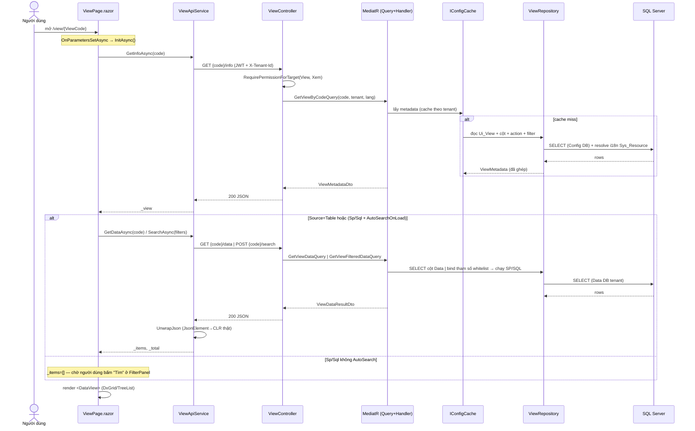
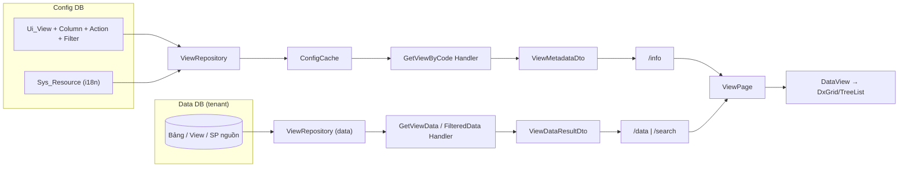

# Màn: Lưới engine (`/view/{ViewCode}`) — MÀN MẪU

> Hiển thị **danh sách metadata-driven** từ `Ui_View`: backend trả *cấu hình lưới* + *dữ liệu*, frontend
> dựng `DataView` (DxGrid/TreeList). **Đa số màn danh mục/nghiệp vụ đi qua đây** — nắm màn này là nắm 70% web.

## 1. Tóm tắt
- **Route:** `/view/{ViewCode}` · **Component:** [`Pages/View/ViewPage.razor`](../../../src/frontend/ICare247_UI/Pages/View/ViewPage.razor) · **Loại:** engine (no-code)
- **Quyền:** `[RequirePermissionForTarget("View", Xem, "code")]` (deny-by-default; SUPERADMIN bypass)
- **Nguồn dữ liệu:** `Ui_View` + cột/action/filter (Config DB) → metadata; bảng/SP/SQL nguồn (Data DB tenant) → dữ liệu
- **3 dạng nguồn (`Source_Type`):** `Table` (SELECT + search), `Sp`/`Sql` (lưới nâng cao, có panel lọc trái)

## 2. Các nhân vật (lớp tham gia)
| Lớp | Vai trò | File |
|---|---|---|
| `ViewPage` | Trang: tải info+data, mở popup Thêm/Sửa/Xóa | [ViewPage.razor](../../../src/frontend/ICare247_UI/Pages/View/ViewPage.razor) |
| `DataView` | Render DxGrid/TreeList từ metadata | [Components/View/DataView.razor](../../../src/frontend/ICare247_UI/Components/View/DataView.razor) |
| `FilterPanel` | Panel lọc trái (nguồn Sp/Sql) | [Components/View/FilterPanel.razor](../../../src/frontend/ICare247_UI/Components/View/FilterPanel.razor) |
| `ViewApiService` | Gọi `/views/{code}/info\|data\|search`, unwrap JSON | [Services/ViewApiService.cs](../../../src/frontend/ICare247_UI/Services/ViewApiService.cs) |
| `ViewController` | REST `/api/v1/views`, kiểm quyền, lấy TenantId | [Api/Controllers/ViewController.cs](../../../src/backend/src/ICare247.Api/Controllers/ViewController.cs) |
| `GetViewByCodeQuery` / `GetViewDataQuery` / `GetViewFilteredDataQuery` | Use-case (MediatR) | `Application/Features/Views/Queries/**` |
| `IConfigCache` / `ConfigCache` | Cache metadata theo tenant (version-stamp) | `Application/Interfaces/IConfigCache.cs` · `Application/Engines/ConfigCache.cs` |
| `IViewRepository` / `ViewRepository` | Dapper đọc Ui_View + dữ liệu nguồn | `Application/Interfaces/IViewRepository.cs` · `Infrastructure/Repositories/ViewRepository.cs` |

## 3. Sequence — tải màn (info → data)



## 3b. Ma trận: NÚT → API → LỆNH CQRS → DB ⭐

> Đọc cột trái sang phải = "bấm nút này thì chạy gì, đụng bảng nào". **Query = đọc, Command = ghi.**

| # | Nút / Thao tác | Handler frontend | API (verb + endpoint) | Quyền | Lệnh CQRS | Bảng DB | R/W |
|---|---|---|---|---|---|---|---|
| 1 | **Mở màn** (cấu hình lưới) | `ViewPage.InitAsync` → `ViewApi.GetInfoAsync` | `GET /api/v1/views/{code}/info` | View·Xem | `GetViewByCodeQuery` | Config DB: `Ui_View(+Column/Action/Filter)`, `Sys_Resource` | R *(qua cache)* |
| 2 | **Tải dữ liệu** (nguồn Table) | `ReloadDataAsync` → `GetDataAsync` | `GET /views/{code}/data` | View·Xem | `GetViewDataQuery` | Data DB: bảng/view nguồn | R |
| 3 | **Bấm "Tìm"** (nguồn Sp/Sql) | `FilterPanel` → `SearchAsync` | `POST /views/{code}/search` | View·Xem | `GetViewFilteredDataQuery` | Data DB: SP/SQL nguồn *(bind whitelist tham số)* | R |
| 4 | **↻ Xóa cache** *(chỉ super-admin)* | `ClearCacheAsync` → `Cache.InvalidateViewAsync` | `POST /views/{code}/invalidate-cache` | *(không attr; ẩn nút ở client)* | — | **KHÔNG chạm DB** — chỉ xóa `IConfigCache` | — |
| 5 | **+ Thêm mới** (popup → Lưu) | `MasterDataForm` → `MasterApi.SaveAsync(id=null)` | `POST /master-data/{form}` | Form·Thêm | `SaveMasterDataCommand` | Data DB: bảng đích — **INSERT** (+`CreatedBy/At` tự bơm) | W |
| 6 | **Sửa** (double-click → Lưu) | `GetByIdAsync` rồi `SaveAsync(id)` | `GET …/{id}` · `PUT /master-data/{form}/{id}` | Form·Xem · Form·Sửa | `GetMasterDataRecordQuery` · `SaveMasterDataCommand` | Data DB: bảng đích — SELECT / **UPDATE** (+`UpdatedBy/At`) | R/W |
| 7 | **Xóa** (icon → dialog) | `ConfirmDeleteDialog` → `GetUsageAsync` rồi `DeleteAsync` | `GET …/{id}/usage` · `DELETE /master-data/{form}/{id}` | Form·Xem · Form·Xóa | `CheckMasterDataUsageQuery` · `DeleteMasterDataCommand` | Data DB: kiểm tham chiếu FK + **DELETE** (chặn 409 nếu đang dùng) | R/W |
| 8 | **Xóa đã chọn (N)** | `BulkDeleteAsync` → lặp `DeleteAsync` | `DELETE /master-data/{form}/{id}` × N | Form·Xóa | `DeleteMasterDataCommand` × N | Data DB: **DELETE** từng dòng | W |
| 9 | **Kéo/resize cột** (tự lưu) | `GridLayoutService` (debounce 600ms) | `PUT /views/{code}/my-layout` | Authorize | — *(IUserGridLayoutStore)* | Data DB: `HT_NguoiDung_LuoiLayout` — **UPSERT** | W |
| 10 | *(mở lại màn)* nạp layout | `GridLayoutService` | `GET /views/{code}/my-layout` | Authorize | — *(IUserGridLayoutStore)* | Data DB: `HT_NguoiDung_LuoiLayout` | R |

**Đọc nhanh:**
- Mọi endpoint qua `[RequirePermissionForTarget]` (deny-by-default, SUPERADMIN bypass) trừ `invalidate-cache` (ẩn nút ở client) và `my-layout` (`[Authorize]`).
- **Đụng DB ghi (W):** chỉ các **Command** ở dòng 5–8 (qua engine MasterData, tự bơm audit) + layout dòng 9.
- **Đụng DB đọc (R):** các **Query** dòng 1–3, 6, 7, 10. Dòng 1 thường lấy từ **cache** (chỉ chạm DB khi cache miss).
- **Không chạm DB:** dòng 4 (chỉ invalidate cache).

## 3c. Tầng Dapper — câu SQL THẬT chạm DB ⭐

> `ViewRepository` dùng **2 connection factory**: `IDbConnectionFactory` → **Config DB** (metadata),
> `IDataDbConnectionFactory` → **Data DB tenant** (dữ liệu). An toàn injection: **giá trị** qua Dapper params (`@x`);
> **identifier** (schema/bảng/cột/SP) whitelist qua regex `^[A-Za-z_][A-Za-z0-9_]*$` rồi bọc `[]` (`Bracket`).

| Lệnh CQRS | Repo.Method (file:dòng) | DB | SQL (rút gọn) | Bảng |
|---|---|---|---|---|
| `GetViewByCodeQuery` | `ViewRepository.GetByCodeAsync` [:41](../../../src/backend/src/ICare247.Infrastructure/Repositories/ViewRepository.cs) | **Config** | 4 câu SELECT: header + columns + actions + filters (LEFT JOIN `Sys_Resource` theo `@LangCode`) | `Ui_View`,`Ui_View_Column`,`Ui_View_Action`,`Ui_View_Filter`,`Sys_Table`,`Ui_Form`,`Sys_Resource` |
| `GetViewDataQuery` | `ViewRepository.GetDataAsync` [:284](../../../src/backend/src/ICare247.Infrastructure/Repositories/ViewRepository.cs) | **Data** | `SELECT {cột whitelist} FROM {bảng} [WHERE … LIKE @Search] ORDER BY {key} OFFSET @Skip FETCH NEXT @Take` + `SELECT COUNT(*)` | bảng/view nguồn |
| `GetViewFilteredDataQuery` | `ViewRepository.GetFilteredDataAsync` [:395](../../../src/backend/src/ICare247.Infrastructure/Repositories/ViewRepository.cs) | **Data** | `EXEC` SP (`CommandType.StoredProcedure`) hoặc SQL text; tham số bind **chỉ từ `view.Filters`** (whitelist `Param_Name`) | SP/SQL nguồn |
| `GetViewsListQuery` | `ViewRepository.GetListAsync` [:504](../../../src/backend/src/ICare247.Infrastructure/Repositories/ViewRepository.cs) | **Config** | CTE `ROW_NUMBER() PARTITION BY View_Code` (ưu tiên bản tenant) + `COUNT(DISTINCT)` | `Ui_View`,`Sys_Table`,`Sys_Resource` |

**Mẫu gọi (`GetDataAsync` — dựng SELECT động an toàn):**
```csharp
var selectCols = string.Join(", ", selectFields.Select(Bracket));        // [Cột] đã whitelist regex
var listSql = $"SELECT {selectCols} FROM {table}{whereSql} " +
              "ORDER BY {orderCol} OFFSET @Skip ROWS FETCH NEXT @Take ROWS ONLY";
using var data = _dataDb.CreateConnection();                             // Data DB của tenant
var rows  = await data.QueryAsync(new CommandDefinition(listSql, dp, cancellationToken: ct));
var total = await data.ExecuteScalarAsync<int>(new CommandDefinition(countSql, dp, ...));
```

> **Cache xen giữa:** `GetViewByCodeQuery` đi qua `IConfigCache` trước — chỉ chạm 4 câu SQL trên khi **cache miss**.
> Ghi (Thêm/Sửa/Xóa) nằm ở repo MasterData (xem [`login.md`](login.md) §3c cho mẫu `INSERT/UPDATE`).

## 4. DFD — dữ liệu đi đâu



## 5. Logic / quy tắc cần biết
- **Tách *metadata* khỏi *dữ liệu*:** `/info` (cấu hình, cache nặng) tải 1 lần; `/data|/search` tải lại khi reload.
- **Lười tải nguồn nặng:** nếu có panel lọc (`HasFilterPanel`) và **không** `AutoSearchOnLoad` → KHÔNG chạy SP lúc mở; chờ bấm **Tìm**. Xem `InitAsync()` [ViewPage.razor:154](../../../src/frontend/ICare247_UI/Pages/View/ViewPage.razor).
- **Ép kiểu JSON:** server trả `JsonElement`; `UnwrapJson` chuyển về CLR thật để DxGrid sort/lọc/format đúng kiểu. [ViewApiService.cs:151](../../../src/frontend/ICare247_UI/Services/ViewApiService.cs).
- **Thêm/Sửa/Xóa = qua `Edit_Form` của View:** popup `MasterDataForm` (`EditFormCode`), Lưu xong → `ReloadDataAsync()` ở **nguyên màn** (không điều hướng).
- **Khóa dòng = `KeyField`:** resolve từ metadata để biết Id khi Sửa/Xóa/Xóa-hàng-loạt.
- **Lưới nâng cao (Sp/Sql):** tham số panel lọc bind **whitelist theo `Filter_Code`** rồi mới chạy SP/SQL (chống SQL injection). Thiếu/sai tham số bắt buộc → server trả **400** kèm message.
- **Tenant:** lấy từ `ITenantContext` (TenantMiddleware), KHÔNG đọc header thẳng trong controller (ADR-018) [ViewController.cs:214](../../../src/backend/src/ICare247.Api/Controllers/ViewController.cs).
- **Cache màn:** super-admin có nút "↻ Xóa cache" → `POST {code}/invalidate-cache` + xóa cache combobox client, rồi `InitAsync()` lại.

## 6. Trường hợp biên & lỗi thường gặp
| Tình huống | Hành vi | Xử ở đâu |
|---|---|---|
| View không tồn tại/ẩn | 404 → banner "Không tìm thấy màn hình" | `GetInfoAsync` trả null → `_error` |
| Thiếu quyền Xem | 403 → thông điệp i18n thân thiện | `BuildFriendlyMessage` [ViewApiService.cs:185](../../../src/frontend/ICare247_UI/Services/ViewApiService.cs) |
| Tham số SP bắt buộc thiếu/sai | 400 → `_notice` (không vỡ trang) | `RunSearchAsync` bắt `HttpRequestException` |
| Hết phiên | 401 → "đăng nhập lại" | `BuildFriendlyMessage` |
| Xóa hàng loạt: dòng bị tham chiếu | đếm riêng "giữ lại", không hỏng cả mẻ | `BulkDeleteAsync` [ViewPage.razor:274](../../../src/frontend/ICare247_UI/Pages/View/ViewPage.razor) |

## 7. Con trỏ code & liên quan
- **Frontend:** `Pages/View/ViewPage.razor`, `Components/View/{DataView,FilterPanel}.razor`, `Services/ViewApiService.cs`
- **Backend:** `Api/Controllers/ViewController.cs`, `Application/Features/Views/Queries/**`, `Infrastructure/Repositories/ViewRepository*.cs`
- **Spec:** [`../../spec/04_ENGINE_SPEC.md`](../../spec/04_ENGINE_SPEC.md), [`../../spec/07_API_CONTRACT.md`](../../spec/07_API_CONTRACT.md)
- **Cấu hình no-code:** [`../../huong-dan-wpf/cau-hinh-man-quan-ly-view.md`](../../huong-dan-wpf/cau-hinh-man-quan-ly-view.md)
- **Debug:** [`../../backend-debug/`](../../backend-debug/) (trang *views*)

---
*Cập nhật: 2026-06-20 — màn mẫu khung onboarding.*
