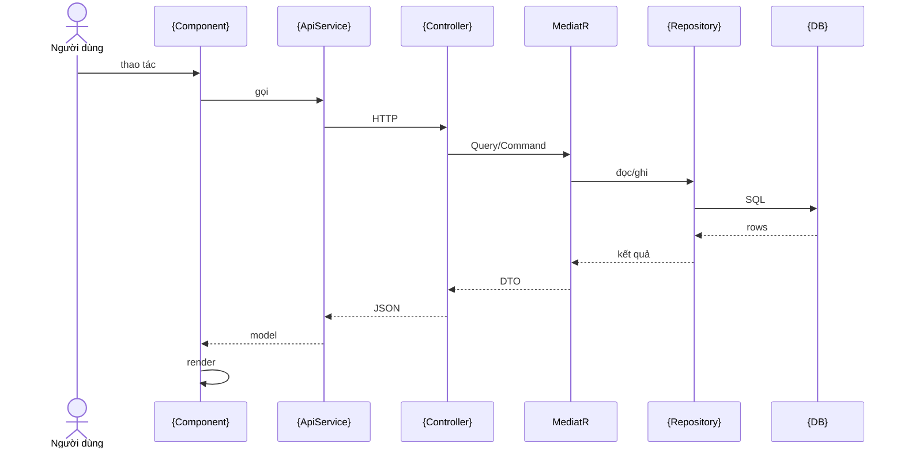
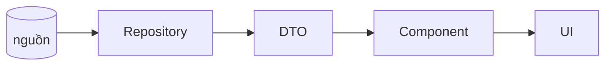

<!--
KHUÔN TÀI LIỆU 1 MÀN — copy file này vào ../man-hinh/{ten-man}.md rồi điền.
Giữ đủ 7 mục. Sơ đồ dùng Mermaid. Mọi tham chiếu code ghi dạng đường/dẫn/File.cs:dòng.
-->

# Màn: {Tên màn} (`{route}`)

> Một câu: màn này để làm gì, ai dùng.

## 1. Tóm tắt
- **Route:** `{route}` · **Component:** `{File.razor}` · **Loại:** {engine / bespoke}
- **Quyền:** {attribute / cờ} · **Nguồn dữ liệu:** {bảng / view / SP}
- **Phụ thuộc nổi bật:** {service, component, engine}

## 2. Các nhân vật (lớp tham gia)
| Lớp | Vai trò | File |
|---|---|---|
| {VD ViewPage} | {trang} | `path:line` |
| ... | ... | ... |

## 3. Sequence — luồng chính (theo thời gian)

## 3b. Ma trận: NÚT → API → LỆNH CQRS → DB
> Query = đọc, Command = ghi. Ghi rõ bảng đụng tới và R/W.

| # | Nút / Thao tác | Handler frontend | API (verb + endpoint) | Quyền | Lệnh CQRS | Bảng DB | R/W |
|---|---|---|---|---|---|---|---|
| 1 | {mở màn} | {service.method} | {GET ...} | {Xem} | {Query} | {DB.bảng} | R |
| 2 | {nút ghi} | {service.method} | {POST/PUT ...} | {Thêm/Sửa} | {Command} | {DB.bảng INSERT/UPDATE} | W |

## 3c. Tầng Dapper — câu SQL thật chạm DB
> Repository mở connection qua `IDataDbConnectionFactory` / `IConfigDbConnectionFactory` rồi chạy Dapper
> (`QueryAsync`/`ExecuteAsync`), tham số hóa, không `SELECT *`.

| Lệnh CQRS | Repo.Method (file:dòng) | SQL (rút gọn) | Bảng | Thao tác |
|---|---|---|---|---|
| {Query} | {Repo.Method} | `SELECT … WHERE …` | {bảng} | đọc |
| {Command} | {Repo.Method} | `INSERT/UPDATE/DELETE …` | {bảng} | ghi |

## 4. DFD — dữ liệu đi đâu

## 5. Logic / quy tắc nghiệp vụ cần biết
- {VD: chỉ tải khi AutoSearch; ép kiểu; phân quyền if-mapped; cache; ...}

## 6. Trường hợp biên & lỗi thường gặp
| Tình huống | Hành vi | Xử ở đâu |
|---|---|---|
| {404 / 403 / 400} | {...} | `path:line` |

## 7. Con trỏ code & liên quan
- Frontend: `path`
- Backend: `path`
- Spec/Guide: `../../spec/...`, `../../guide/...`

---
*Cập nhật: {ngày} — {người/đổi gì}.*
